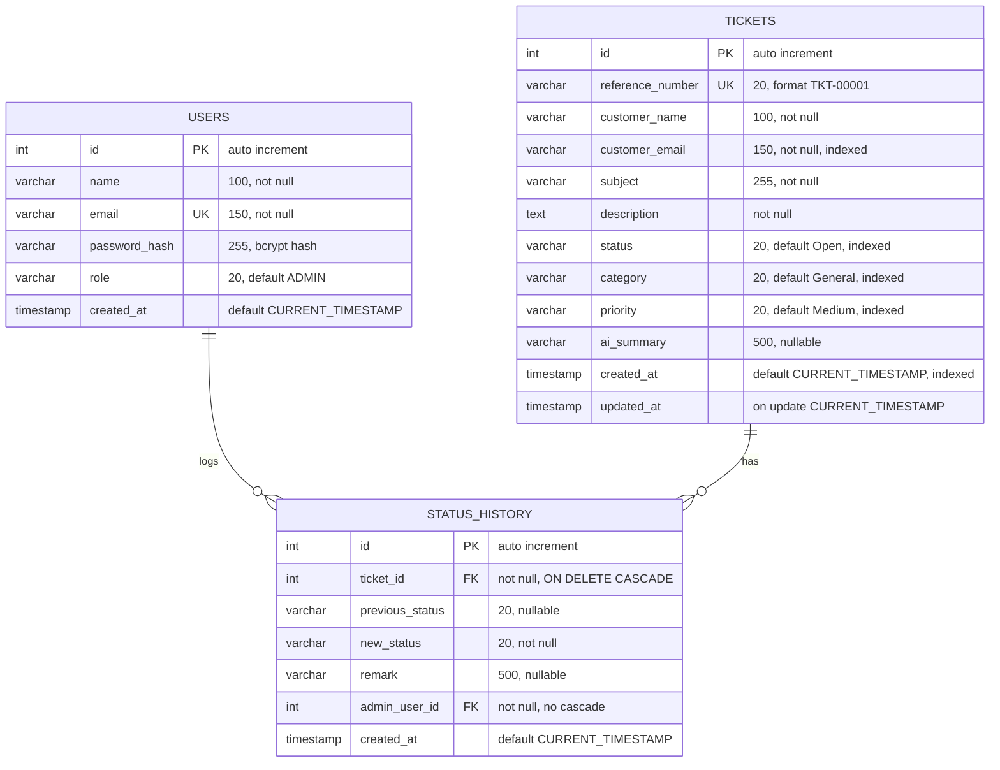

# SmartDesk

SmartDesk is an AI-assisted support ticket management system built as a technical assessment project.

The system allows customers to raise support tickets through a public support portal. Each ticket is validated and stored in the database, then an AI service suggests the ticket category, priority, and a short summary.

Administrators can log in securely, view and manage tickets, search and filter tickets, update ticket status, correct AI classifications, and view the complete status history.

## Key Features

- Public support ticket submission
- Server-side and browser-side validation
- Automatic ticket reference number generation
- AI-assisted ticket classification
- Admin login with JWT authentication
- Role-based admin authorization
- Ticket search, filtering, and pagination
- Ticket detail and status history
- Ticket status management
- Manual category and priority correction
- Admin dashboard with ticket counts
- Responsive frontend
- REST APIs
- MySQL database

## Technology Stack

### Backend

- Python
- FastAPI
- SQLAlchemy
- Pydantic
- JWT Authentication
- Passlib + Bcrypt

### Frontend

- HTML5
- CSS3
- JavaScript

### Database

- MySQL

### AI

- Google Gemini API

### Development Tools

- Visual Studio Code
- MySQL Workbench
- Git
- GitHub
- Swagger / OpenAPI

## Project Structure

```text
SmartDesk/
├── backend/
│   ├── app/
│   │   ├── auth/
│   │   │   ├── dependencies.py
│   │   │   ├── jwt.py
│   │   │   └── password.py
│   │   │
│   │   ├── database/
│   │   │   └── database.py
│   │   │
│   │   ├── models/
│   │   │   ├── user.py
│   │   │   ├── ticket.py
│   │   │   └── status_history.py
│   │   │
│   │   ├── routes/
│   │   │   ├── auth.py
│   │   │   └── tickets.py
│   │   │
│   │   ├── schemas/
│   │   │   ├── auth.py
│   │   │   ├── ticket.py
│   │   │   └── user.py
│   │   │
│   │   ├── services/
│   │   │   └── ai_service.py
│   │   │
│   │   └── main.py
│   │
│   ├── .env.example
│   ├── seed_admin.py
│   ├── test_ai.py
│   └── requirements.txt
│
├── database/
│   └── schema.sql
│
├── frontend/
│   ├── index.html
│   ├── login.html
│   ├── dashboard.html
│   ├── tickets.html
│   ├── ticket-detail.html
│   ├── confirmation.html
│   │
│   ├── css/
│   │   └── style.css
│   │
│   └── js/
│       ├── auth.js
│       ├── ticket.js
│       ├── tickets.js
│       ├── ticket-detail.js
│       └── dashboard.js
│
└── README.md
```

## System Architecture

SmartDesk follows a layered architecture where the frontend communicates with the backend through REST APIs.

```text
Customer / Admin
       │
       ▼
HTML + CSS + JavaScript
       │
       │ HTTP / REST API
       ▼
FastAPI Backend
       │
       ├── Routes
       │      │
       │      ▼
       │   Services
       │      │
       │      ▼
       │   SQLAlchemy
       │      │
       │      ▼
       │    MySQL
       │
       └── Gemini AI
              │
              ▼
       Ticket Classification
       Category / Priority / Summary
```

## Backend Layer Responsibilities

### Routes

Handles HTTP requests and API endpoints.

Examples:
- Admin login
- Ticket creation
- Ticket listing
- Ticket detail
- Ticket status update
- Ticket classification update
- Dashboard

### Schemas

Uses Pydantic models to validate request and response data.

Examples:
- LoginRequest
- TicketCreate
- StatusUpdateRequest
- ClassificationUpdateRequest

### Models

Uses SQLAlchemy models to represent database tables.

Main models:
- User
- Ticket
- StatusHistory

### Services

Contains reusable business logic, including AI ticket classification.

### Database

SQLAlchemy connects the application to MySQL and performs database operations.

### Authentication

JWT-based authentication protects admin APIs. Passwords are securely hashed using Bcrypt.

## Authentication and Authorization Flow

```text
Admin Login
     ↓
Email + Password
     ↓
Find User in MySQL
     ↓
Verify Bcrypt Password
     ↓
Generate JWT Token
     ↓
Frontend Receives Token
     ↓
Token Sent as Bearer Token
     ↓
FastAPI Validates JWT
     ↓
Find Current User
     ↓
Check User Role
     ↓
ADMIN Authorization
     ↓
Access Protected API
```

## REST API Endpoints

### Authentication

| Method | Endpoint | Authentication | Description |
|---|---|---|---|
| POST | `/api/auth/login` | Public | Admin login and JWT token generation |

### Tickets

| Method | Endpoint | Authentication | Description |
|---|---|---|---|
| POST | `/api/tickets` | Public | Create a new support ticket |
| GET | `/api/tickets` | JWT | List tickets with search, filters, and pagination |
| GET | `/api/tickets/{id}` | JWT | Get ticket details and status history |
| PATCH | `/api/tickets/{id}/status` | Admin JWT | Update ticket status and create history |
| PATCH | `/api/tickets/{id}/classification` | Admin JWT | Correct ticket category and priority |
| GET | `/api/tickets/dashboard` | Admin JWT | Get dashboard ticket statistics and recent activity |

Protected endpoints expect the token from the login response in an
`Authorization` header:

```text
Authorization: Bearer <access_token>
```

Tokens are signed with HS256 and expire 60 minutes after they are issued.

### POST /api/auth/login

Request:

```json
{
    "email": "admin@smartdesk.com",
    "password": "your-password"
}
```

Response `200 OK`:

```json
{
    "access_token": "eyJhbGciOiJIUzI1NiIsInR5cCI6IkpXVCJ9...",
    "token_type": "bearer",
    "user": {
        "id": 1,
        "name": "SmartDesk Admin",
        "email": "admin@smartdesk.com",
        "role": "ADMIN"
    }
}
```

On bad credentials the response is `401 Unauthorized` with
`{"detail": "Invalid email or password"}`.

### POST /api/tickets

Public. Request:

```json
{
    "customer_name": "Priya Raman",
    "customer_email": "priya@example.com",
    "subject": "Cannot reset my password",
    "description": "The reset email never arrives even after several attempts."
}
```

Response `201 Created`:

```json
{
    "id": 1,
    "reference_number": "TKT-00001",
    "customer_name": "Priya Raman",
    "customer_email": "priya@example.com",
    "subject": "Cannot reset my password",
    "description": "The reset email never arrives even after several attempts.",
    "status": "Open",
    "category": "Account",
    "priority": "High",
    "ai_summary": "Customer is not receiving password reset emails."
}
```

Validation is enforced by Pydantic: `customer_name` 2–100 characters,
`customer_email` must be a valid address, `subject` 3–255 characters, and
`description` at least 5 characters. A violation returns `422`.

### GET /api/tickets

Requires a token. Supported query parameters:

| Parameter | Default | Description |
|---|---|---|
| `search` | none | Partial match on reference number, subject, or customer email |
| `status` | none | Exact match on status |
| `category` | none | Exact match on category |
| `priority` | none | Exact match on priority |
| `page` | `1` | Page number, minimum `1` |
| `page_size` | `10` | Rows per page, between `1` and `100` |

Example: `GET /api/tickets?status=Open&priority=High&page=1&page_size=10`

Response `200 OK` (results are ordered newest first):

```json
{
    "items": [
        {
            "id": 1,
            "reference_number": "TKT-00001",
            "customer_name": "Priya Raman",
            "customer_email": "priya@example.com",
            "subject": "Cannot reset my password",
            "description": "The reset email never arrives even after several attempts.",
            "status": "Open",
            "category": "Account",
            "priority": "High",
            "ai_summary": "Customer is not receiving password reset emails."
        }
    ],
    "page": 1,
    "page_size": 10,
    "total": 1,
    "total_pages": 1
}
```

### GET /api/tickets/{id}

Requires a token. Returns the ticket plus its full status history.

Response `200 OK`:

```json
{
    "id": 1,
    "reference_number": "TKT-00001",
    "customer_name": "Priya Raman",
    "customer_email": "priya@example.com",
    "subject": "Cannot reset my password",
    "description": "The reset email never arrives even after several attempts.",
    "status": "In Progress",
    "category": "Account",
    "priority": "High",
    "ai_summary": "Customer is not receiving password reset emails.",
    "created_at": "2026-09-18T10:15:00",
    "updated_at": "2026-09-18T11:02:00",
    "status_history": [
        {
            "id": 1,
            "previous_status": "Open",
            "new_status": "In Progress",
            "remark": "Investigating the mail delivery logs.",
            "admin_user_id": 1,
            "created_at": "2026-09-18T11:02:00"
        }
    ]
}
```

An unknown id returns `404` with `{"detail": "Ticket not found"}`.

### PATCH /api/tickets/{id}/status

Admin only. Request:

```json
{
    "status": "In Progress",
    "remark": "Investigating the mail delivery logs."
}
```

`status` must be one of `Open`, `In Progress`, `Resolved`, `Closed`. `remark`
is optional. The response is the same shape as `GET /api/tickets/{id}`, with a
new entry appended to `status_history`.

Two cases return `400`:

- an unrecognised status, with `"Invalid status. Allowed values: Open, In Progress, Resolved, Closed"`
- resubmitting the status the ticket already has, with `"Ticket is already in this status"`

### PATCH /api/tickets/{id}/classification

Admin only. Used to correct the AI's suggestion. Request:

```json
{
    "category": "Technical",
    "priority": "Medium"
}
```

Both fields are required. `category` must be one of `Technical`, `Billing`,
`Account`, `General`, and `priority` one of `Low`, `Medium`, `High`. An invalid
value returns `400`. The response is the updated ticket.

### GET /api/tickets/dashboard

Admin only. Response `200 OK`:

```json
{
    "total_tickets": 42,
    "open_tickets": 12,
    "in_progress_tickets": 8,
    "resolved_tickets": 15,
    "closed_tickets": 7,
    "category_counts": {
        "Technical": 18,
        "Billing": 9,
        "Account": 11,
        "General": 4
    },
    "priority_counts": {
        "High": 10,
        "Medium": 22,
        "Low": 10
    },
    "last_7_days": [
        { "date": "2026-09-12", "count": 3 },
        { "date": "2026-09-13", "count": 5 },
        { "date": "2026-09-14", "count": 2 },
        { "date": "2026-09-15", "count": 8 },
        { "date": "2026-09-16", "count": 6 },
        { "date": "2026-09-17", "count": 4 },
        { "date": "2026-09-18", "count": 1 }
    ],
    "latest_tickets": [
        {
            "id": 42,
            "reference_number": "TKT-00042",
            "subject": "Invoice shows the wrong amount",
            "customer_name": "Arun Kumar",
            "category": "Billing",
            "priority": "Medium",
            "status": "Open",
            "created_at": "2026-09-18T09:40:00"
        }
    ]
}
```

`last_7_days` always contains exactly seven entries, oldest first, including
days with a count of zero. `latest_tickets` is capped at the five newest
tickets.

## Database

SmartDesk uses MySQL as its relational database.

### Database Name

`smartdesk_db`

### Entity Relationship Diagram



`STATUS_HISTORY` is the join point between the two parent tables. Both foreign
keys are mandatory, so every history row names both the ticket it describes and
the admin who caused the change.

- One ticket has many status history rows, through
  `status_history.ticket_id → tickets.id`. The foreign key is
  `ON DELETE CASCADE`, so deleting a ticket removes its history with it.
- One admin user has many status history rows, through
  `status_history.admin_user_id → users.id`. There is no cascade here, so a
  user row cannot be deleted while any history entry still references it.
- `users` and `tickets` are not linked directly. Tickets are created by
  members of the public, who have no user account. The only connection between
  the two tables is the history an admin generates while working a ticket.

### Table: users

| Column | Type | Constraints | Description |
|---|---|---|---|
| `id` | INT | Primary key, auto increment | Internal user id |
| `name` | VARCHAR(100) | Not null | Display name |
| `email` | VARCHAR(150) | Not null, unique | Login identifier |
| `password_hash` | VARCHAR(255) | Not null | Bcrypt hash, never the plain password |
| `role` | VARCHAR(20) | Not null, default `ADMIN` | Checked when authorising admin routes |
| `created_at` | TIMESTAMP | Default `CURRENT_TIMESTAMP` | Row creation time |

### Table: tickets

| Column | Type | Constraints | Description |
|---|---|---|---|
| `id` | INT | Primary key, auto increment | Internal ticket id |
| `reference_number` | VARCHAR(20) | Unique, indexed | Public reference, `TKT-` plus the zero-padded id, for example `TKT-00001` |
| `customer_name` | VARCHAR(100) | Not null | Submitted by the customer |
| `customer_email` | VARCHAR(150) | Not null, indexed | Submitted by the customer |
| `subject` | VARCHAR(255) | Not null | Short title |
| `description` | TEXT | Not null | Full problem description |
| `status` | VARCHAR(20) | Not null, default `Open`, indexed | `Open`, `In Progress`, `Resolved`, `Closed` |
| `category` | VARCHAR(20) | Not null, default `General`, indexed | `Technical`, `Billing`, `Account`, `General` |
| `priority` | VARCHAR(20) | Not null, default `Medium`, indexed | `Low`, `Medium`, `High` |
| `ai_summary` | VARCHAR(500) | Nullable | One-line AI summary, null when classification failed |
| `created_at` | TIMESTAMP | Default `CURRENT_TIMESTAMP`, indexed | Submission time |
| `updated_at` | TIMESTAMP | Default `CURRENT_TIMESTAMP`, `ON UPDATE CURRENT_TIMESTAMP` | Last modification time |

`reference_number` is nullable at the column level because the row is inserted
before the id exists. The value is assigned immediately afterwards in the same
transaction, so a committed ticket always has one.

### Table: status_history

| Column | Type | Constraints | Description |
|---|---|---|---|
| `id` | INT | Primary key, auto increment | Internal history id |
| `ticket_id` | INT | Not null, FK to `tickets.id`, `ON DELETE CASCADE`, indexed | Ticket the change belongs to |
| `previous_status` | VARCHAR(20) | Nullable | Status before the change |
| `new_status` | VARCHAR(20) | Not null | Status after the change |
| `remark` | VARCHAR(500) | Nullable | Optional note from the admin |
| `admin_user_id` | INT | Not null, FK to `users.id`, indexed | Admin who made the change |
| `created_at` | TIMESTAMP | Default `CURRENT_TIMESTAMP` | When the change happened |

A row is written only when the status actually changes. Category and priority
corrections are not recorded in this table.

### A Note on Allowed Values

`status`, `category`, `priority`, and `role` are plain `VARCHAR` columns with
no `ENUM` or `CHECK` constraint. The permitted values are enforced in the API
layer, not by MySQL, so writes made directly against the database can bypass
them.

### Database Setup

The database schema is provided in:

`database/schema.sql`

To create the database and tables:

1. Open MySQL Workbench.
2. Open `database/schema.sql`.
3. Execute the script.

The script creates:

- `smartdesk_db`
- `users`
- `tickets`
- `status_history`

The `status_history` table maintains relationships with both `tickets` and `users` using foreign keys.

### Admin Seed Data

After creating the database, run the admin seed script:

```bash
cd backend
python seed_admin.py
```

The default administrator account created by the seed script is:

- Email: Value configured in `ADMIN_EMAIL`
- Password: Value configured in `ADMIN_PASSWORD`
- Role: `ADMIN`

The password is securely hashed before being stored in the database.

## AI Integration

SmartDesk uses the Google Gemini API to assist with automatic ticket classification.

When a customer creates a ticket, the backend sends the ticket subject and description to the AI service.

The AI suggests:

- Category
- Priority
- Short summary

### AI Processing Flow

```text
Customer creates ticket
        ↓
Ticket saved with default values
        ↓
Subject + Description
        ↓
Gemini AI
        ↓
Category + Priority + Summary
        ↓
Validate AI response
        ↓
Update ticket
```

### Approach

Classification lives in `app/services/ai_service.py`, behind a single
`classify_ticket(subject, description)` function. Routes never talk to the
model directly, so the provider can be swapped without touching the API layer.

The prompt pins the model to a fixed output contract: raw JSON only, no
markdown, with exactly three keys, and `category` and `priority` restricted to
a named list. The reply is parsed with `json.loads` and then re-checked in
Python against the same allowed sets. A reply that parses but contains an
unexpected category, an unexpected priority, or an empty summary is rejected
in full rather than partly applied.

The ticket is inserted with the defaults `Open`, `General`, and `Medium`
before the model is called, and updated afterwards inside the same
transaction.

### Assumptions

- **AI output is advisory, never authoritative.** Admins can overwrite the
  category and priority at any time through
  `PATCH /api/tickets/{id}/classification`.
- **Ticket submission must never fail because of the AI.** Every failure mode
  is caught in one `except Exception` block, logged, and turned into the
  fallback `General` / `Medium` / `ai_summary = null`. The customer's ticket is
  saved either way.
- **Failures are silent to the customer.** There is no user-facing signal that
  classification fell back. A ticket showing `General` / `Medium` with no
  summary is indistinguishable from one the model genuinely classified that
  way.
- **The call is synchronous.** It runs inside the `POST /api/tickets`
  request, so submission latency includes a round trip to Gemini. There is no
  queue or background worker.
- **No retries.** A single failed call goes straight to the fallback.
- **Classification runs once, at creation.** Editing a ticket later does not
  re-run the model.
- **The model is trusted to keep the summary short.** `ai_summary` is
  `VARCHAR(500)`, and nothing truncates a longer reply before it is written.
- **A missing or invalid `GEMINI_API_KEY` is not startup-fatal.** The client is
  constructed at import time regardless, and the problem only shows up as every
  ticket falling back to the defaults.

## Setup and Installation

### Prerequisites

Make sure the following are installed:

- Python 3.12
- MySQL 8 or later (server running)
- Git

### 1. Clone the Repository

```bash
git clone <your-github-repository-url>
cd SmartDesk
```

### 2. Create the Environment File

Copy the example file and fill in your own values:

```bash
cd backend
cp .env.example .env
```

Then open `backend/.env` and update every value:

| Variable | Description |
|---|---|
| `DB_HOST` | MySQL host, usually `127.0.0.1` |
| `DB_PORT` | MySQL port, usually `3306` |
| `DB_NAME` | Must be `smartdesk_db` |
| `DB_USER` | Your MySQL username |
| `DB_PASSWORD` | Your MySQL password |
| `JWT_SECRET_KEY` | Any long random string used to sign tokens |
| `GEMINI_API_KEY` | Google Gemini API key, from Google AI Studio |
| `ADMIN_NAME` | Display name for the seeded admin |
| `ADMIN_EMAIL` | Login email for the seeded admin |
| `ADMIN_PASSWORD` | Login password for the seeded admin |

`.env` is listed in `.gitignore` and must never be committed.

### 3. Create the Database

The schema is in `database/schema.sql`. It creates `smartdesk_db` and the
`users`, `tickets`, and `status_history` tables. The script is safe to run more
than once because every statement uses `IF NOT EXISTS`.

Open the MySQL client, then load the file from inside the prompt:

```bash
mysql -u root -p
```

```sql
source /full/path/to/SmartDesk/database/schema.sql;
exit;
```

Do not use `mysql -u root -p < database/schema.sql`. When the input is
redirected, the client reads the password from the first line of the file
instead of prompting, and the command fails with `ERROR 1045 Access denied`
without creating anything. If you prefer a single command, put the password
directly on the flag with no space after `-p`:

```bash
mysql -u root -pYOUR_PASSWORD < database/schema.sql
```

Alternatively, open `database/schema.sql` in MySQL Workbench and execute it.

### 4. Install Backend Dependencies

From the `backend` directory:

#### Windows

```bash
python -m venv venv
venv\Scripts\activate
pip install -r requirements.txt

### macOS and Linux
```bash
python3.12 -m venv venv
source venv/bin/activate      

pip install -r requirements.txt
```

### 5. Seed the Admin Account

Still inside `backend`, with the virtual environment active:

```bash
python seed_admin.py
```

This prints `Admin account created successfully.` on the first run and
`Admin already exists.` afterwards. The account uses the `ADMIN_EMAIL` and
`ADMIN_PASSWORD` values from `.env`, and the password is hashed with bcrypt
before it is stored.

### 6. Run the Backend

```bash
uvicorn app.main:app --reload
```

The API runs at `http://127.0.0.1:8000`. Keep this port, because the frontend
has it hardcoded in `API_BASE_URL`.

Check that it started correctly:

- `http://127.0.0.1:8000/` returns `SmartDesk API is running`
- `http://127.0.0.1:8000/test-db` returns `"database": "smartdesk_db"`
- `http://127.0.0.1:8000/docs` opens the Swagger UI

### 7. Run the Frontend

The frontend is built using HTML, CSS, and JavaScript.

No separate frontend server is required.

Make sure the FastAPI backend is running at:

`http://127.0.0.1:8000`

Then open the following file directly in a web browser:

`frontend/index.html`

### Public Customer Flow

`index.html` → Submit Ticket → `confirmation.html`

### Admin Flow

Open:

`frontend/login.html`

Then log in using the `ADMIN_EMAIL` and `ADMIN_PASSWORD`
configured in `backend/.env`.

After login:

`login.html` → `dashboard.html` → `tickets.html` → `ticket-detail.html`